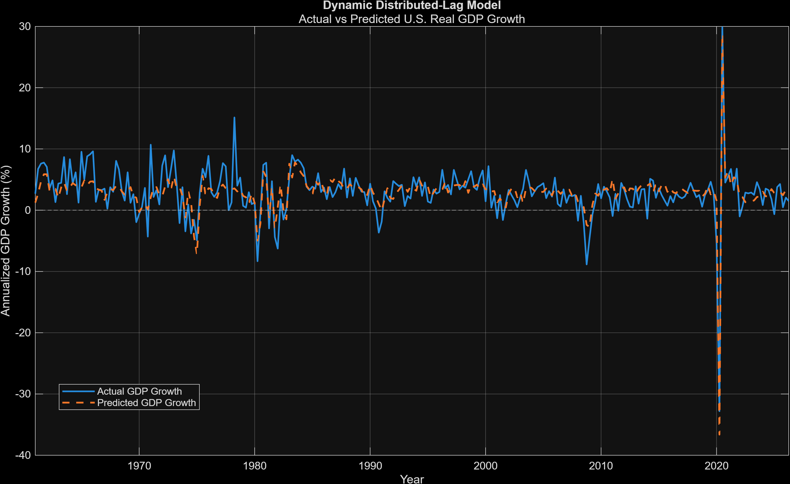
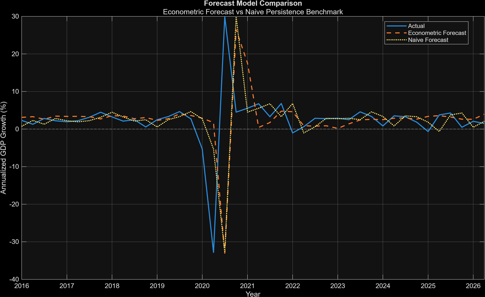
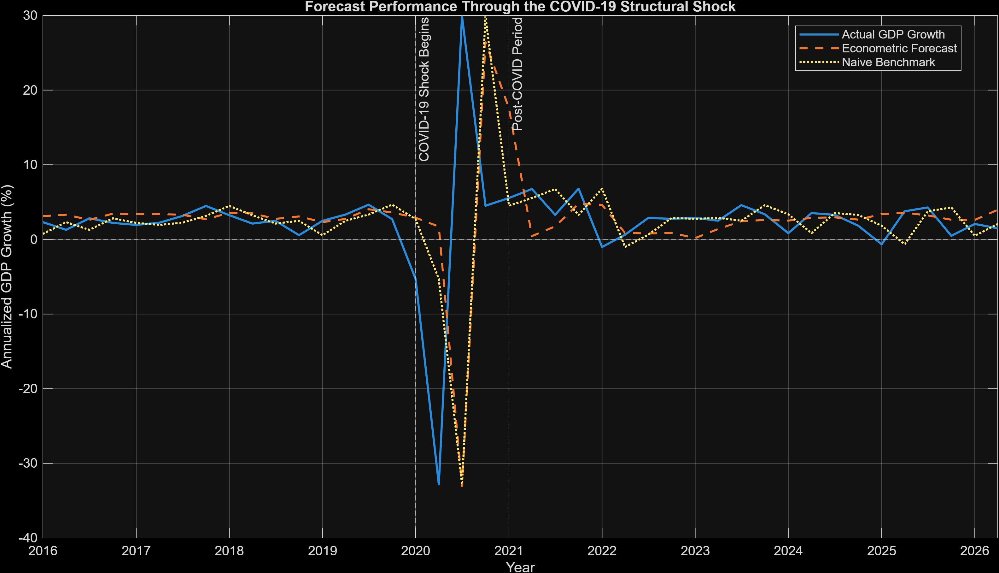
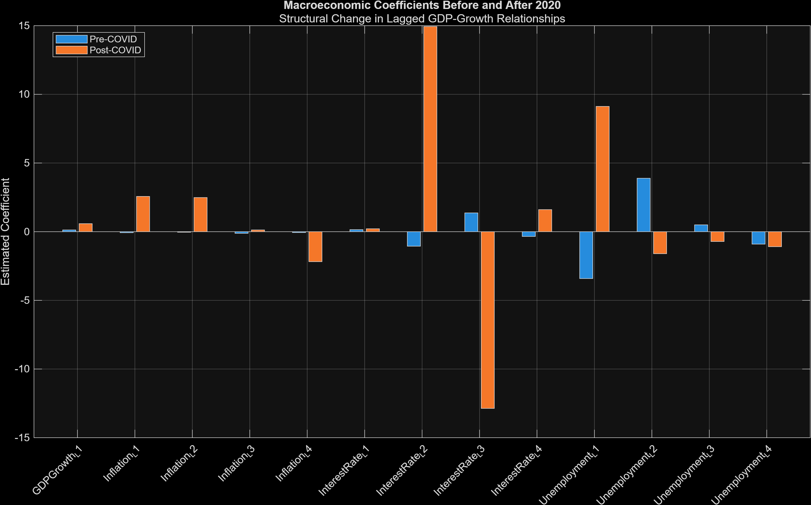
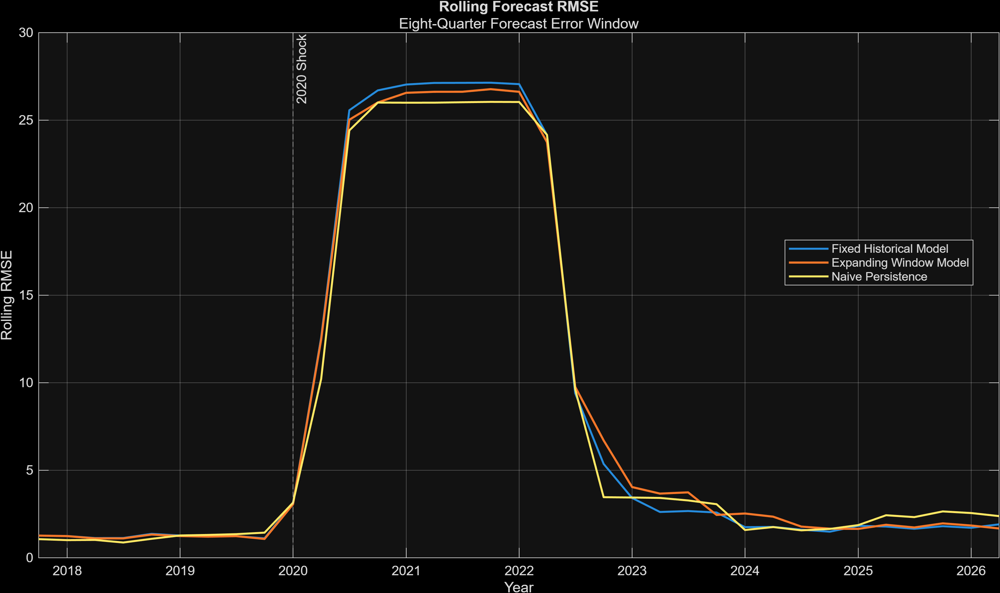
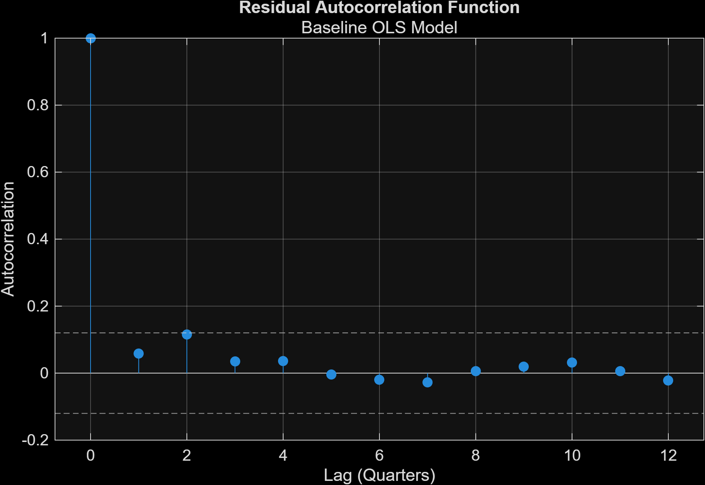
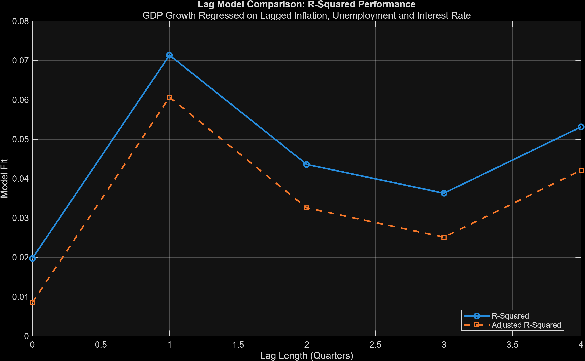
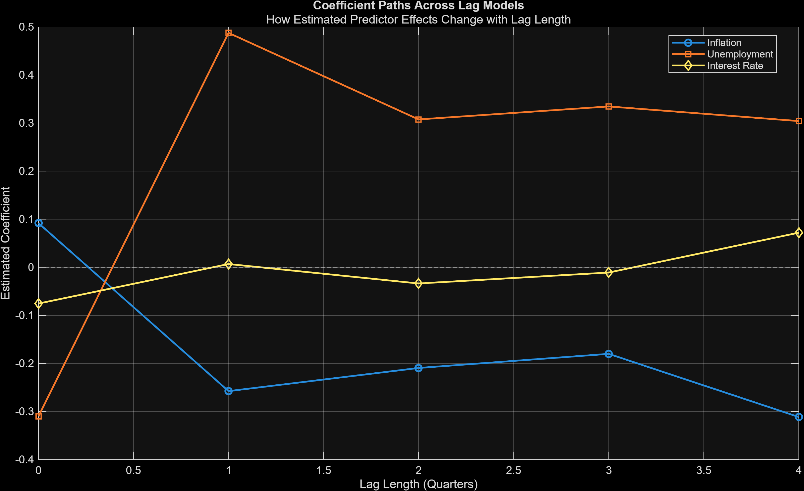
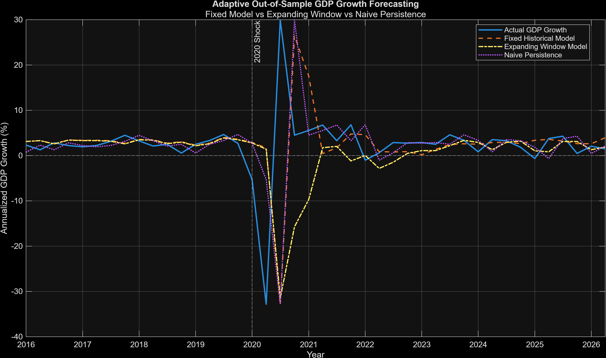
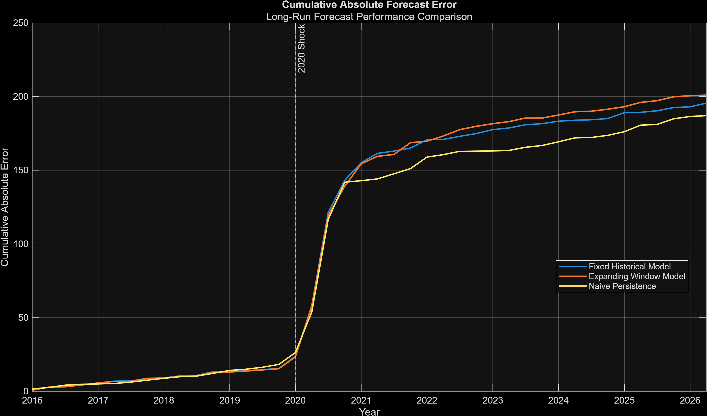

# U.S. Macroeconomic Dynamics & GDP Growth Forecasting in MATLAB

[](https://www.mathworks.com/products/matlab.html)
[](https://fred.stlouisfed.org/)
[](#)

An end-to-end **macroeconometrics and forecasting project in MATLAB** using U.S. Federal Reserve Economic Data (FRED). The project studies how GDP growth interacts dynamically with inflation, unemployment, and monetary-policy conditions, then tests whether those relationships remain useful when forecasting genuinely unseen data.

The central result is deliberately not a perfect forecasting story: dynamic lag structures improve historical explanatory fit dramatically, but the COVID-era break reveals substantial instability and limits out-of-sample generalization. That contrast between **in-sample fit, forecast validation, and structural change** is the core of the project.

## Executive Research Dashboard


A vector PDF version is also available at [`figures/39_Final_Research_Dashboard.pdf`](figures/39_Final_Research_Dashboard.pdf).

## Research Question

> **How do inflation, unemployment, interest rates, and prior economic conditions relate to U.S. real GDP growth over time, and can lagged macroeconomic information improve out-of-sample GDP-growth forecasts?**

## Headline Results

| Finding | Result |
|---|---:|
| Quarterly observations | **266** |
| Baseline contemporaneous OLS R² | **1.98%** |
| Baseline adjusted R² | **0.85%** |
| Dynamic distributed-lag R² | **66.99%** |
| Dynamic distributed-lag adjusted R² | **64.83%** |
| Dynamic model RMSE | **2.40** |
| Pre-COVID RMSE improvement vs persistence | **5.58%** |
| Pre-COVID MAE improvement vs persistence | **14.81%** |
| 2020 structural-break F-statistic | **12.43** |
| Structural-break significance | **p < 0.001** |
| Best full-test-sample RMSE | **11.53 — naive persistence** |

## Key Findings

### 1. Static contemporaneous relationships explain little GDP-growth variation

The baseline OLS model regressing current GDP growth on current inflation, unemployment, and the federal funds rate produced an R² of only **1.98%** and an adjusted R² of **0.85%**. This suggests that same-quarter macroeconomic variables alone provide limited explanatory power for quarterly real GDP growth.

### 2. Timing and lag structure matter substantially

Once dynamic effects were introduced, historical model fit improved sharply. The distributed-lag specification achieved an R² of **66.99%** and an adjusted R² of **64.83%**.

This improvement is interpreted as evidence that macroeconomic relationships are strongly time-dependent — **not** as proof that the model is automatically a strong forecaster.



### 3. High in-sample fit did not translate into full-sample forecasting dominance

A true out-of-sample test was created using a pre-2016 training sample and unseen observations from 2016 onward. The econometric forecast did **not** beat a naive persistence forecast across the entire test window.

That distinction is central to the project: historical fit and genuine predictive performance are evaluated separately.



### 4. Forecast performance was regime-dependent

During the relatively stable **2016–2019 pre-COVID period**, the lag-based econometric model improved on naive persistence by approximately:

- **5.58% on RMSE**
- **14.81% on MAE**

Performance deteriorated sharply during the 2020 shock and remained weaker than persistence in the post-COVID regime.



### 5. The 2020 period exhibits strong structural instability

A manually implemented Chow-style structural-break test around 2020 produced an F-statistic of approximately **12.43** with **p < 0.001**, providing strong evidence that the regression relationships were unstable across the specified breakpoint.

The pre/post coefficient comparison reinforces this regime-shift interpretation.



### 6. Adaptive re-estimation helped, but did not fully solve the forecasting problem

An expanding-window model re-estimated coefficients before each forecast. It improved RMSE slightly relative to the fixed historical specification, but still did not outperform naive persistence over the full post-2016 test period.

This supports a broader conclusion: **adaptive estimation can reduce some parameter staleness, but extreme structural change remains difficult to forecast with a compact linear macroeconomic model.**



## Data

The project uses public U.S. macroeconomic series downloaded directly from **Federal Reserve Economic Data (FRED)**:

| Series | FRED ID | Role in project |
|---|---|---|
| Real Gross Domestic Product | `GDPC1` | GDP level and quarterly growth |
| Unemployment Rate | `UNRATE` | Labor-market condition |
| Consumer Price Index | `CPIAUCSL` | Inflation calculation |
| Federal Funds Effective Rate | `FEDFUNDS` | Monetary-policy condition |

Monthly series are converted to quarterly frequency and synchronized with quarterly real GDP. GDP growth and inflation are calculated using annualized quarterly log differences.

Raw downloads are retained in [`data/`](data/) alongside the processed quarterly modelling dataset.

## Methodology

```text
FRED data acquisition
        ↓
Raw-data preservation
        ↓
Date cleaning & frequency harmonization
        ↓
Quarterly GDP-growth / inflation transformations
        ↓
Exploratory data analysis
        ↓
Baseline OLS regression
        ↓
Residual & multicollinearity diagnostics
        ↓
Lag-length comparison
        ↓
Dynamic distributed-lag regression
        ↓
True out-of-sample forecasting
        ↓
Naive persistence benchmark
        ↓
Regime robustness analysis
        ↓
2020 structural-break analysis
        ↓
Expanding-window adaptive forecasting
        ↓
Executive research dashboard
```

## Econometric Diagnostics

The baseline specification includes checks for:

- Durbin–Watson residual autocorrelation
- Variance Inflation Factors (VIF)
- Jarque–Bera residual normality
- residual autocorrelation function
- residual-vs-fitted behavior
- Q–Q diagnostics
- standardized residuals

The baseline diagnostics showed low multicollinearity (maximum VIF approximately **1.61**) and a Durbin–Watson statistic near **1.87**, while residual normality was rejected — consistent with the presence of large macroeconomic shocks.



## Lag Analysis

Simple models using common lags from zero through four quarters were compared using R², adjusted R², RMSE, AIC, BIC, and F-statistics. A one-quarter lag produced the strongest adjusted R² among those simple common-lag specifications.



The project then moved to a richer distributed-lag model allowing different historical observations to enter simultaneously.



## Adaptive Forecasting

The final forecasting stage compares three approaches:

1. **Fixed historical model** — coefficients estimated once using the initial training sample.
2. **Expanding-window model** — coefficients re-estimated before every one-step-ahead forecast.
3. **Naive persistence** — next-quarter growth equals previous-quarter growth.

The expanding-window model slightly reduced RMSE relative to the fixed model, but naive persistence remained the strongest full-sample benchmark.





## Project Structure

```text
matlab-macroeconomic-forecasting/
│
├── data/       # Raw FRED series and processed quarterly dataset
├── figures/    # 39 analytical visualizations + final dashboard PDF
├── results/    # Model outputs, diagnostics, forecasts and KPI tables
├── scripts/    # 12 sequential MATLAB analysis scripts
├── .gitignore
└── README.md
```

## Analysis Pipeline

| Phase | MATLAB script | Purpose |
|---:|---|---|
| 01 | `import_fred_data_01.m` | Automated FRED data acquisition |
| 02 | `clean_transform_data_02.m` | Cleaning, quarterly harmonization and transformations |
| 03 | `exploratory_analysis_03.m` | Descriptive statistics and macroeconomic visualizations |
| 04 | `regression_model_04.m` | Baseline OLS model |
| 05 | `diagnostics_05.m` | Regression diagnostics |
| 06 | `lag_model_comparison_06.m` | Common-lag model comparison |
| 07 | `dynamic_distributed_lag_07.m` | Dynamic distributed-lag regression |
| 08 | `out_of_sample_forecast_08.m` | Genuine out-of-sample forecast design |
| 09 | `forecast_robustness_09.m` | Pre-COVID / COVID / post-COVID robustness |
| 10 | `structural_break_analysis_10.m` | 2020 structural-break analysis |
| 11 | `expanding_window_forecast_11.m` | Adaptive expanding-window forecasting |
| 12 | `final_research_dashboard_12.m` | Executive dashboard and final KPI summary |

## Reproducing the Project

1. Clone the repository.
2. Open MATLAB and set the repository root as the **Current Folder**.
3. Add the `scripts` directory to the MATLAB path if required:

```matlab
addpath("scripts")
```

4. Run the scripts sequentially from Phase 01 through Phase 12.
5. Generated data, model results, and figures are written automatically to their respective folders.

The first phase downloads the source series from FRED, making the data pipeline reproducible without manually copying observations into MATLAB.

## Tools & Skills Demonstrated

`MATLAB` · `Econometrics` · `Time-Series Analysis` · `OLS Regression` · `Distributed Lags` · `Forecast Validation` · `Structural Breaks` · `Expanding-Window Backtesting` · `Data Visualization` · `FRED` · `Git` · `GitHub`

## Interpretation & Limitations

This project is an empirical portfolio study rather than a causal macroeconomic model. Coefficients should therefore be interpreted primarily as conditional associations within each specification.

Important limitations include:

- linear functional forms may miss nonlinear macroeconomic relationships;
- structural shocks can make historically estimated coefficients unstable;
- the post-2020 subsample is relatively small for a high-dimensional lag model;
- contemporaneous explanatory models are distinct from information-feasible forecasting models;
- strong in-sample R² should not be interpreted as evidence of strong out-of-sample forecasting ability;
- the Chow-style breakpoint result is conditional on the specified 2020 break date.

These limitations are intentionally retained in the analysis rather than hidden, because the project focuses on **model validation and economic interpretation**, not simply maximizing fit.

## Selected Outputs

Additional outputs available in the repository include:

- correlation heatmap;
- OLS residual diagnostics;
- observed-vs-fitted analysis;
- lag coefficient paths;
- inflation, unemployment, and interest-rate lag effects;
- forecast-error time series;
- regime-specific RMSE and MAE comparisons;
- structural coefficient changes;
- adaptive coefficient evolution;
- cumulative forecast-error comparison;
- machine-readable CSV result tables.

## Author

**Sayak Pranab Ghosh**

MBA, Department of Management Studies, IIT Roorkee

---

### Portfolio Summary

Built an end-to-end MATLAB macroeconometrics pipeline using more than six decades of U.S. macroeconomic history, integrating automated FRED ingestion, data-frequency harmonization, OLS diagnostics, dynamic distributed-lag modelling, structural-break analysis, benchmarked out-of-sample forecasting, and expanding-window adaptation. The project found strong regime dependence: the model reduced pre-COVID MAE by approximately **14.8%** versus persistence, while the 2020 break materially weakened the stability of historical relationships.
