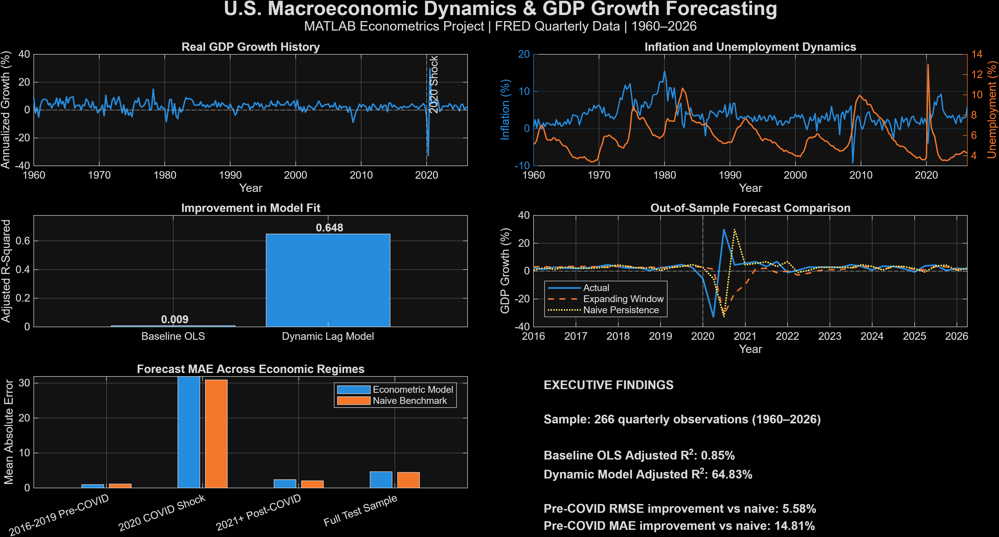

# U.S. Macroeconomic Dynamics & GDP Growth Forecasting in MATLAB

[](https://www.mathworks.com/products/matlab.html)
[](https://github.com/sayakdoms/matlab-macroeconomic-forecasting/actions/workflows/matlab-ci.yml)
[](https://fred.stlouisfed.org/)
[](#testing)

## Project overview

This repository is a reproducible 12-phase macroeconometrics and forecasting study built in MATLAB. It combines public U.S. Federal Reserve Economic Data (FRED), quarterly data engineering, classical OLS, distributed lags, structural-break analysis, benchmarked out-of-sample forecasts, expanding-window estimation, diagnostics, and portfolio-ready reporting.

The central result is deliberately nuanced: dynamic lag structures explain substantially more historical GDP-growth variation than a static contemporaneous model, but that improvement does not translate into forecast dominance over a simple persistence benchmark across the full post-2016 test period. The COVID-era break exposes substantial parameter instability.

The project now has a single entry point, configuration-aware phase functions, reusable helpers, validation checks, and end-to-end parity tests. It can run from any MATLAB working directory once the repository root is on the MATLAB path.

## Research question

> How do inflation, unemployment, interest rates, and prior economic conditions relate to U.S. real GDP growth over time, and can information available before a forecast quarter improve genuinely out-of-sample GDP-growth predictions?

This question is evaluated through two deliberately separate model classes:

- **Explanatory/in-sample models** measure conditional historical relationships. The Phase 4 baseline uses contemporaneous variables, and the Phase 7 dynamic model includes contemporaneous and lagged regressors. These specifications are not presented as real-time forecasting models.
- **Forecast-feasible out-of-sample models** use only information from `t-1` or earlier. Phases 8 and 11 train before 2016 and evaluate observations from 2016 onward without contemporaneous predictor leakage.

## Key findings

| Finding | Committed result |
|---|---:|
| Quarterly observations | **266** |
| Baseline contemporaneous OLS R² | **1.98%** |
| Baseline adjusted R² | **0.85%** |
| Dynamic distributed-lag R² | **66.99%** |
| Dynamic distributed-lag adjusted R² | **64.83%** |
| Dynamic model RMSE | **2.40** |
| Pre-COVID RMSE improvement vs persistence | **5.58%** |
| Pre-COVID MAE improvement vs persistence | **14.81%** |
| Fixed 2020 structural-break F-statistic | **12.43** |
| Structural-break significance | **p < 0.001** |
| Best full-test-sample RMSE | **11.53 — naive persistence** |

The baseline contemporaneous model explains little quarterly GDP-growth variation. Adding GDP-growth persistence and distributed macroeconomic lags raises historical fit sharply, showing that timing matters for explanatory modeling. That higher in-sample fit should not be read as proof of forecasting power.

For the pre-2016 fixed-coefficient model, full-test-sample RMSE is approximately **11.95**. Recursive expanding-window estimation lowers it slightly to approximately **11.79**, but naive persistence remains best at approximately **11.53**. During the comparatively stable 2016–2019 period, however, the econometric forecast improves on persistence by **5.58% on RMSE** and **14.81% on MAE**. Forecast performance is therefore regime-dependent rather than uniformly superior.

The fixed 2020 Q1 Chow-style breakpoint produces an F-statistic of approximately **12.43** with **p < 0.001**. This supports the project’s headline conclusion: dynamic relationships substantially improve historical explanatory fit, while structural instability limits forecast generalization during major shocks.



A vector version is available at [`figures/39_Final_Research_Dashboard.pdf`](figures/39_Final_Research_Dashboard.pdf).

## Repository structure

```text
Macroeconomics_Econometrics_MATLAB/
├── run_all.m                 # One-command entry point and execution summary
├── scripts/                  # Twelve independently callable phase functions
├── src/+macro/               # Configuration, validation, design and statistics helpers
├── tests/                    # Unit, phase-parity and end-to-end tests
├── data/                     # Four raw snapshots and processed quarterly data
├── results/                  # CSV model outputs, diagnostics, forecasts and text summary
├── figures/                  # Analytical PNGs and vector dashboard PDF
├── index.html                # Portfolio/GitHub Pages site
├── styles.css                # Portfolio-site styling
├── LICENSE
└── README.md
```

### Analysis phases

| Phase | Function | Purpose |
|---:|---|---|
| 01 | `import_fred_data_01` | Load committed FRED snapshots or refresh them explicitly |
| 02 | `clean_transform_data_02` | Validate, harmonize, aggregate and transform the data |
| 03 | `exploratory_analysis_03` | Descriptive statistics and exploratory figures |
| 04 | `regression_model_04` | Baseline contemporaneous OLS model |
| 05 | `diagnostics_05` | Residual, normality, ARCH and multicollinearity diagnostics |
| 06 | `lag_model_comparison_06` | Varying-sample common-lag comparison from zero to four quarters |
| 07 | `dynamic_distributed_lag_07` | Explanatory 17-column dynamic distributed-lag model |
| 08 | `out_of_sample_forecast_08` | Fixed-coefficient, forecast-feasible post-2015 evaluation |
| 09 | `forecast_robustness_09` | Pre-COVID, COVID, post-COVID and full-sample metrics |
| 10 | `structural_break_analysis_10` | Fixed 2020 Q1 Chow-style structural-break calculation |
| 11 | `expanding_window_forecast_11` | Strictly recursive estimation and persistence comparison |
| 12 | `final_research_dashboard_12` | KPI table, executive summary and final dashboard |

## One-command reproduction

### Requirements

- **MATLAB R2026a** is the tested release and recommended reproducibility target.
- The repository root must be on the MATLAB path so MATLAB can locate `run_all.m`; the current folder itself can be anywhere.
- Compatibility with earlier MATLAB releases has not been established. The code relies on modern tables/timetables, string and name-value syntax, `arguments` blocks, tiled layouts, and `exportgraphics`.

With the repository root on the MATLAB path, run:

```matlab
summary = run_all;
```

`run_all.m` locates the repository from its own file location, temporarily adds only `src` and `scripts`, restores the incoming MATLAB path through cleanup, creates configured output directories, runs Phases 01–12 in order, prints phase status and elapsed time, and returns a structured execution summary.

From an arbitrary shell working directory, the equivalent single command is:

```powershell
matlab -batch "addpath('C:/path/to/Macroeconomics_Econometrics_MATLAB'); summary = run_all;"
```

### Configured and fast execution

```matlab
summary = run_all( ...
    OutputRoot="C:/path/to/output", ...
    RefreshData=false, ...
    GenerateFigures=false, ...
    StopOnError=true);
```

| Option | Default | Behavior |
|---|---:|---|
| `RefreshData` | `false` | Uses the committed raw FRED snapshots. This is the stable, parity-tested default. |
| `GenerateFigures` | `true` | Generates all PNG/PDF artifacts. Set to `false` to retain analytical outputs while skipping plotting and export. |
| `OutputRoot` | repository root | Redirects generated `data`, `results`, and `figures` directories to an isolated location. Source snapshots remain read-only when `RefreshData=false`. |
| `StopOnError` | `true` | Stops immediately and raises a phase-specific error. When false, the execution summary records the failure and the pipeline attempts subsequent phases. |

In the tested Windows/MATLAB R2026a environment, the complete run with figures took approximately **459 seconds**, while `GenerateFigures=false` took approximately **6.8 seconds**. These are environment-specific reference timings, not performance guarantees.

## Testing

Run the complete test suite from the repository root with:

```matlab
addpath("tests");
results = run_tests;
```

From another working directory, add the absolute `tests` path instead. The current verified status is:

- **97 passed**
- **0 failed**
- **0 incomplete**

The suite covers project-root detection, configuration and safe output creation; raw and quarterly validation; lag alignment; no-leakage provenance; OLS and forecast metrics; independently callable phases; committed-output parity; figure-free execution; MATLAB-path restoration; and complete end-to-end reproduction in temporary output roots.

## Toolboxes and environment-dependent diagnostics

The core estimators are implemented in project code. The unchanged full pipeline requires **MATLAB** and **Statistics and Machine Learning Toolbox** because `corr` is used directly; in R2026a that toolbox also supplies `jbtest`, `qqplot`, and `fcdf`. The code retains its existing fallback or `NaN` behavior if those three diagnostic functions are individually unavailable.

**Econometrics Toolbox is optional.** It supplies `archtest`; when that function is unavailable, the ARCH result is recorded as `NaN` with an explicit warning.

- Required: MATLAB R2026a (tested target) and Statistics and Machine Learning Toolbox.
- Optional: Econometrics Toolbox for the ARCH test.
- No HAC/Newey–West estimator, alternate p-value method, or toolbox-specific replacement estimator is introduced.

The committed `Diagnostic_Summary.csv` was produced in an environment where `archtest` was unavailable, so its ARCH fields are `NaN`. In the tested R2026a environment, `archtest` is available and returns rejection with a p-value of approximately **3.66 × 10⁻¹⁵**. This expected environment-dependent diagnostic does not affect the regression coefficients, forecast results, headline KPIs, or committed artifacts. MATLAB may also warn that the Jarque–Bera p-value is below its smallest tabulated value and return `0.001`.

## Data sources

The project uses public U.S. macroeconomic series from [Federal Reserve Economic Data](https://fred.stlouisfed.org/):

| Series | FRED ID | Project role |
|---|---|---|
| Real Gross Domestic Product | `GDPC1` | Real GDP level and quarterly growth |
| Unemployment Rate | `UNRATE` | Labor-market condition |
| Consumer Price Index for All Urban Consumers | `CPIAUCSL` | Inflation calculation |
| Effective Federal Funds Rate | `FEDFUNDS` | Monetary-policy condition |

Monthly series are converted to quarterly frequency and synchronized with quarterly real GDP. GDP growth and inflation use the project’s existing annualized quarterly log-difference transformations.

`RefreshData=false` reads the four committed raw CSV snapshots, making results stable even if FRED later revises historical observations. `RefreshData=true` explicitly downloads current series from FRED and can therefore produce different samples or results; refreshed output should be directed to a separate `OutputRoot` when preservation of committed artifacts matters.

## Pipeline outputs

A complete figure-producing run creates:

- **5 data files** — four raw FRED tables and one processed quarterly dataset;
- **26 result/text files** — descriptive statistics, model tables, diagnostics, forecasts, KPI tables, and the executive summary;
- **40 PNG/PDF artifacts** — 39 numbered PNG outputs plus the vector dashboard PDF;
- **71 total outputs**.

The default filenames and schemas are parity-tested. With `GenerateFigures=false`, the same 5 data files and 26 analytical result/text files are generated, while the configured figures directory remains empty.

## Reproducibility design

- The entry point derives the project root from `run_all.m`, not `pwd`.
- Every phase accepts an optional shared configuration and remains independently callable.
- Input paths and output roots are explicit; isolated runs do not write into the caller’s working directory.
- Required directories are validated and created safely before execution.
- Raw and processed tables are checked for required variables, numeric observations, valid and unique dates, quarterly continuity, finite values, and positive GDP/CPI levels.
- Shared helpers centralize lag construction, OLS conventions, and forecast metrics without changing the original methodology.
- Synthetic alignment tests and committed-output comparisons protect samples, ordering, schemas, filenames, statistics, forecasts, and headline conclusions.

## Forecast no-leakage design

The explanatory Phase 7 model intentionally includes contemporaneous inflation, unemployment, and interest rates and is assessed as an in-sample relationship model.

Forecasting in Phases 8, 10, and 11 uses a separate design matrix containing GDP growth lag 1 and lags 1–4 of inflation, unemployment, and interest rates. No predictor uses information from quarter `t` or later. Phase 8 estimates fixed coefficients using observations before 2016; Phase 11 re-estimates strictly on rows preceding each forecast quarter. Both are compared against naive persistence, defined as the previous quarter’s GDP growth.

Tests verify predictor source-row indices, training boundaries, recursive training sizes, and the absence of contemporaneous forecast columns.

## Limitations

This is an empirical portfolio study, not a causal structural macroeconomic model. Important limitations include:

- linear specifications may miss nonlinearities, interactions, and asymmetric responses;
- classical covariance and normal-approximation p-values are retained rather than robust/HAC inference;
- the Chow-style result is conditional on a fixed 2020 Q1 breakpoint;
- the post-break sample is small relative to the dynamic model dimension;
- FRED observations are revised and the project does not use real-time vintage data;
- the models do not incorporate survey expectations, financial-market variables, mixed frequencies, or publication lags;
- strong in-sample fit does not imply forecast accuracy, as the persistence comparison demonstrates.

## Future methodology extensions

Potential extensions—none of which are claimed as implemented—include HAC/Newey–West inference, multiple-break or Bai–Perron procedures, real-time FRED vintages, rolling-window alternatives, regularization, richer forecast benchmarks, nonlinear models, and formal forecast-comparison tests. These should be introduced as new methodology rather than folded silently into the parity-preserving pipeline.

## Portfolio site

The repository includes a static portfolio presentation in [`index.html`](index.html) with styling in [`styles.css`](styles.css). It is structured for GitHub Pages or another static host. No public deployment URL is asserted here because the repository does not contain one.

## Author

**Sayak Pranab Ghosh**<br>
MBA, Department of Management Studies, IIT Roorkee

## License

See [`LICENSE`](LICENSE).
